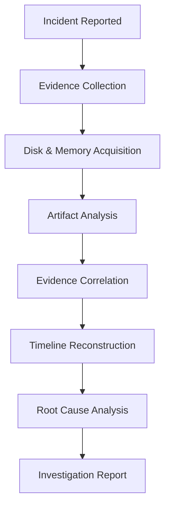

# 🧪 DFIR Labs

<div align="center">

# Digital Forensics & Incident Response Laboratory

### Evidence Collection • Artifact Analysis • Timeline Reconstruction • Incident Investigation


</div>

---

# 📖 Overview

This repository documents my **6-week Digital Forensics & Incident Response (DFIR) Internship** completed at **Cyberster**.

Throughout the internship, I investigated real-world forensic scenarios by analyzing digital evidence collected from Windows systems, disk images, memory captures, email artifacts, registry hives, browser data, and system metadata. Each investigation followed a structured forensic methodology, emphasizing evidence preservation, artifact correlation, timeline reconstruction, and technical reporting.

Rather than focusing on offensive security, this repository demonstrates practical DFIR skills used to determine **what happened, how it happened, when it happened, and what evidence supports the findings.**

Every weekly lab includes the official internship task brief together with my complete forensic investigation report documenting methodology, evidence, analysis, screenshots, and conclusions.

---

# 🎯 Repository Objectives

- Perform forensic investigations using industry-standard methodologies
- Analyze Windows forensic artifacts
- Investigate disk images and file systems
- Examine Windows Registry hives
- Perform browser forensic analysis
- Investigate email artifacts
- Conduct memory forensic analysis
- Analyze USB device activity
- Correlate evidence across multiple artifact sources
- Reconstruct investigation timelines
- Produce professional forensic investigation reports

---

# 🔬 DFIR Investigation Workflow



---

# 🛠️ Technologies

| Category | Technologies |
|-----------|-------------|
| Disk Forensics | Autopsy, FTK Imager |
| Memory Forensics | Volatility 2.6, Volatility 3 |
| Registry Analysis | Registry Explorer |
| Timeline Analysis | Timeline Explorer |
| Shell Link Analysis | LECmd |
| Prefetch Analysis | PECmd |
| Operating Systems | Windows XP, Windows 10 |
| Evidence Formats | E01 Images, Memory Dumps |
| Hash Verification | CertUtil |
| Investigation Methodology | DFIR Process |

---

# 🔍 Core Forensic Skills Demonstrated

| Evidence Analysis | Investigation | Reporting |
|------------------|--------------|-----------|
| Windows Registry | Incident Investigation | Technical Documentation |
| Browser Forensics | Timeline Reconstruction | Evidence Reporting |
| Email Forensics | Artifact Correlation | Investigation Reports |
| Memory Forensics | Root Cause Analysis | Professional Documentation |

---

# 🧩 Evidence Sources Investigated

| Evidence Source | Investigation Purpose |
|-----------------|-----------------------|
| Windows Registry | User Activity & System Configuration |
| Windows Event Logs | Authentication & System Events |
| Browser History | User Browsing Activity |
| Email Artifacts | Communication Analysis |
| Windows Prefetch | Program Execution |
| LNK Files | File Access History |
| Recycle Bin | Deleted File Investigation |
| Thumbcache | Image Activity |
| Memory Dumps | Running Processes & Malware Analysis |
| USB Artifacts | External Device Activity |
| File System Metadata | Timeline Reconstruction |

---

# 🎓 Learning Outcomes

Throughout this internship, I developed practical experience in forensic investigations by collecting, validating, analyzing, and correlating digital evidence from multiple independent sources.

### Key Competencies

- Digital Forensics
- Incident Response
- Windows Registry Forensics
- Windows Artifact Analysis
- Browser Forensics
- Email Forensics
- Memory Forensics
- USB Device Forensics
- Timeline Reconstruction
- Evidence Correlation
- Root Cause Analysis
- Hash Verification
- Chain of Custody Awareness
- Technical Documentation
- Forensic Reporting

---

# 📚 Weekly Investigation Roadmap

Each folder contains the official internship task brief together with my completed forensic investigation report documenting the methodology, evidence collected, analysis performed, screenshots, findings, and conclusions.

| Week | Investigation Focus | Skills Developed |
|:---:|----------------------|------------------|
| ✅ [Week-07](./Week-07) | File System & Disk Forensics | Disk Images, NTFS, File Recovery |
| ✅ [Week-08](./Week-08) | Windows Artifact Analysis | Event Logs, Prefetch, Browser Cache, Thumbcache |
| ✅ [Week-09](./Week-09) | Browser & Application Forensics | SQLite Analysis, LNK Files, Browser Artifacts |
| ✅ [Week-10](./Week-10) | Windows Registry Forensics | Registry Hives, USB History, MRU Analysis |
| ✅ [Week-11](./Week-11) | Email Forensics & Timeline Analysis | Outlook Artifacts, Super Timeline, Evidence Correlation |
| ✅ [Week-12](./Week-12) | DFIR Capstone Investigation | Memory, Registry, USB, Network & Timeline Correlation |

---

# 📂 Repository Structure

```text
DFIR-Labs
│
├── README.md
│
├── Week-07
│   ├── README.md
│   ├── DFIR_Report_Week_07.pdf
│   └── DFIR_Week_07_TaskBrief.pdf
│
├── Week-08
├── Week-09
├── Week-10
├── Week-11
└── Week-12
```

---

# 🏆 Investigation Highlights

✔ Conducted six complete DFIR investigations using real-world forensic scenarios

✔ Analyzed Windows Registry, Prefetch, LNK files, Event Logs, Browser Artifacts and Email evidence

✔ Investigated memory dumps using Volatility

✔ Performed forensic analysis on EnCase (E01) disk images

✔ Correlated evidence across multiple independent artifact sources

✔ Reconstructed user activity through forensic timelines

✔ Investigated USB device activity and external media usage

✔ Validated forensic evidence using cryptographic hash verification

✔ Applied structured DFIR investigation methodologies

✔ Produced professional forensic reports with supporting evidence and conclusions

---

# 🔬 Investigation Methodology

Every investigation followed a structured forensic workflow to ensure evidence integrity and repeatability.

```text
Incident Report

        ↓

Evidence Acquisition

        ↓

Evidence Verification

        ↓

Artifact Identification

        ↓

Artifact Analysis

        ↓

Evidence Correlation

        ↓

Timeline Reconstruction

        ↓

Root Cause Analysis

        ↓

Investigation Report
```

---

# 📑 Documentation Standards

Each weekly investigation follows a consistent documentation format.

Every report includes:

- 📌 Investigation Objectives
- 🛠️ Lab Environment
- 🔍 Investigation Methodology
- 📂 Evidence Collection
- 📷 Screenshots & Supporting Evidence
- 🧠 Technical Analysis
- 📈 Findings
- 🎯 Conclusions
- 📚 Skills Demonstrated

---

# ⚖️ Core Forensic Principles

Throughout every investigation, emphasis was placed on industry-standard forensic practices including:

- Evidence Integrity
- Repeatable Investigation Methodology
- Artifact Correlation
- Timeline Accuracy
- Evidence-Based Conclusions
- Technical Documentation
- Chain of Custody Awareness

---

# 👨‍💻 About Me

I'm **Muhammad Ubaid Roman**, a Computer Science student with a strong interest in Digital Forensics, Incident Response, Security Operations, and Blue Team engineering.

This repository showcases the practical investigations I completed during my DFIR internship at Cyberster and serves as part of my professional cybersecurity portfolio.

---

# ⚖️ Disclaimer

This repository is intended solely for educational and professional portfolio purposes.

All investigations were conducted in authorized laboratory environments as part of the Cyberster Digital Forensics & Incident Response Internship.

No unauthorized analysis or testing was performed against production systems or third-party infrastructure.

---

<div align="center">

## 🧪 From Digital Evidence to Actionable Intelligence

**Thank you for visiting this repository.**

⭐ If you found this project useful, consider giving it a Star.

</div>
